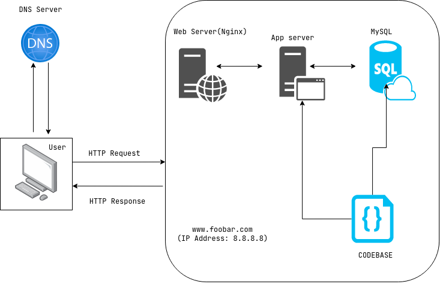

# Simple Web Stack

---

## Whats a Server

## What is the role of the domain name

## What type of DNS record `www` is in `www.foobar.com`

## What is the role of the web server

## What is the role of the application server

## What is the role of the database

## What the server is using to communicate with the computer
